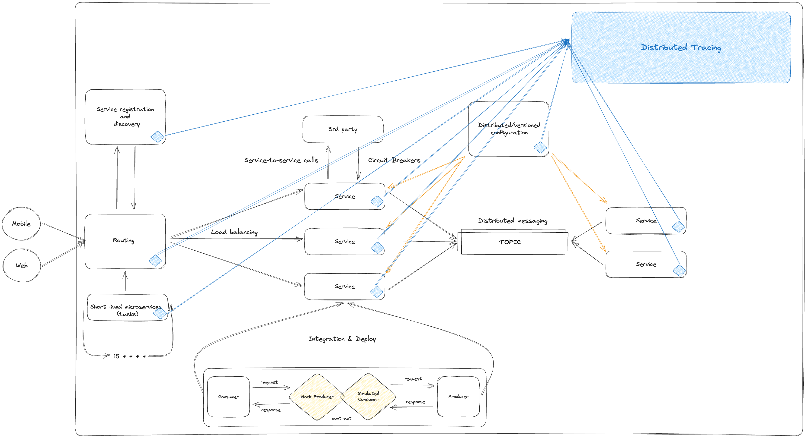
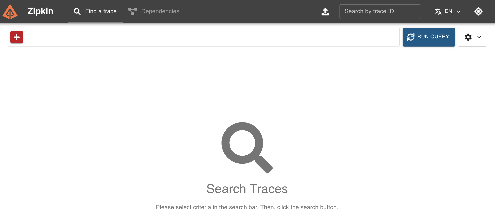

# spring-cloud-ecosystem

- 클라우드 서비스에서 제공하는 분산 컴퓨팅을 활용하기 위한 개념인 클라우드 네이티브에 대해 학습합니다.
- Spring 생태계 내에서 쉽게 활용할 수 있도록 Spring Cloud 생태계에 대해 학습합니다.

---

## ecosystem



---

## toc

### introduction

- [what is cloud native?](introduction/what_is_cloud_native.md)

### concept of cloud native features

- [service registration and discovery](concept_of_cloud_native_features/service_registration_and_discovery.md)
- [trace for distributed application](concept_of_cloud_native_features/trace_for_distributed_application.md)
- [distributed/versioned configuration](concept_of_cloud_native_features/distributed_versioned_configuration.md)
- [routing & load balancing](concept_of_cloud_native_features/routing_and_load_balancing.md)
- [service-to-service calls](concept_of_cloud_native_features/service-to-service_calls.md)
- [distributed messaging](concept_of_cloud_native_features/distributed_messaging.md)
- [short lived microservices (tasks)](concept_of_cloud_native_features/short_lived_microservices.md)
- [consumer-driven and producer-driven contract testing](concept_of_cloud_native_features/consumer-driven_and_producer-driven_contract_testing.md)

---

## install

### 0. check requirements

- jdk 17 +
- gradle 8.8 + (default)

### 1. install [docker](https://docs.docker.com/engine/install/) & [docker-compose](https://docs.docker.com/compose/install/)

### 2. clone this repository

```shell
git clone https://github.com/swszz/spring-cloud-ecosystem.git
```

### 3. change directory

```shell
cd spring-cloud-ecosystem
```

### 4. build spring cloud ecosystem applications

```shell
./gradlew clean build
```

### 5. build images use docker compose

```shell
docker-compose build
```

### 6. run built images use docker compose

```shell
docker-compose up
```

### 7. surf on spring cloud ecosystem infrastructures

#### [Service Discovery (Eureka)](http://localhost:8761)


#### [Trace System (Zipkin)](http://localhost:9411/zipkin)



##### [Trace Sample (execute run query)](http://localhost:9411/zipkin/?serviceName=automation-order)


#### [Resource Monitor (Spring Admin)](http://localhost:9090)


#### [Batch, Task and Deploy Monitor (Spring Cloud Dataflow)](http://localhost:9393/dashboard)


---

## trouble shooting

### not found spring cloud dataflow

#### 1. remove containers use docker compose

```shell
docker-compose rm -f
```

#### 2. run built images use docker compose

```shell
docker-compose up
```
