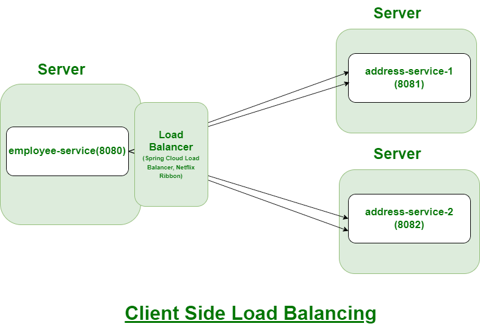
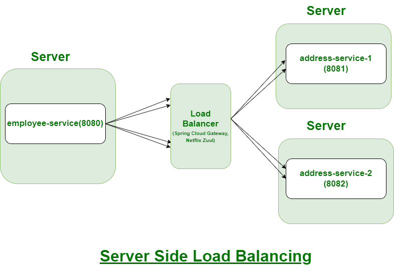

# routing & load balancing

## 두 줄 요약

- 로드 밸런싱은 애플리케이션을 지원하는 리소스 풀 전체에 네트워크 트래픽을 균등하게 배포하는 방법이다.
- 로드 밸런서는 사용자와 서버 그룹 사이에 위치하며 중복되는 리소스 서버들이 동일하게 사용되도록 하는 장치이다.

## 설명

### 간략 소개

### 구현 방법

#### clinet side load balancing

- 클라이언트가 직접 로드 밸런싱을 수행한다. 클라이언트는 서비스 인스턴스 목록을 알고 있으며, 각 요청을 보낼 때 어떤 인스턴스를 사용할지 직접 결정한다.

##### 특징

- 클라이언트는 서비스 인스턴스의 목록을 캐싱하거나, 서비스 디스커버리 도구를 통해 동적으로 조회한다.
- 클라이언트는 라운드 로빈, 랜덤, 가중치 기반 등 다양한 로드 밸런싱 알고리즘을 사용해 요청을 분산시킨다.
- 예시로는 Spring Cloud Netflix Ribbon, Spring Cloud LoadBalancer, Feign 이 있다.

##### 장점

- 각 클라이언트가 독립적으로 로드 밸런싱 알고리즘을 선택하고 조정할 수 있다.
- 클라이언트가 직접 로드 밸런싱을 수행하기 때문에, 중앙 집중형 로드 밸런서의 부하를 줄일 수 있다.

##### 단점

- 클라이언트에서 로드 밸런싱 로직을 구현하고 유지해야 하여 복잡성이 증가할 수 있다.
- 각 클라이언트가 서로 다른 인스턴스 목록을 가질 수 있기 때문에 일관된 로드 밸런싱이 어려울 수 있다.
    - 서비스 인스턴스 목록은 서비스 디스커버리 도구로부터 주기적으로 업데이트를 받는데, 클라이언트별 갱신 타이밍이 다른 경우 각 클라이언트가 서로 다른 인스턴스 목록을 가질 수 있다.
    - 서비스 인스턴스의 상태 변화가 각 클라이언트의 로드밸런서에 반영되는 시점이 네트워크 지연 또는 캐싱 문제 등으로 지연될 수 있다.
    - 각 클라이언트가 독립적으로 로드 밸런싱을 하기 때문에 요청방식과 시점에 따라 트래픽이 바르게 분산되지 않을 수 있다.

---

#### server side load balancing

- 중앙 집중형 로드 밸런서가 모든 트래픽을 수신하고, 적절한 서비스 인스턴스로 요청을 분산시킨다. 클라이언트는 로드 밸런서로 요청을 보내고 로드 밸런서는 내부적으로 로드 밸런싱을 수행한다.

##### 특징

- 중앙에 있는 로드 밸런서가 모든 클라이언트 요청을 수신하여 처리한다.
- 클라이언트는 로드 밸런서의 주소를 통해 서비스에 접근한다. (단일 진입점)
- 예시로는 Nginx, HAProxy, Spring Cloud Gateway, Kubernetes Ingress, AWS ELB/ALB 가 있다.

##### 장점

1. 클라이언트는 로드 밸런서에 요청을 보내기만 하면 로드 밸런싱에 대해 고려하지 않아 비즈니스 로직에 집중할 수 있다.
2. 중앙 집중형 로드 밸런서가 모든 트래픽을 관리하기 때문에 일관된 로드 밸런싱을 보장할 수 있다.
3. TLS 종료, 모니터링, 트래픽 관리 등의 부가 기능을 로드 밸런서에 쉽게 추가할 수 있다.

##### 단점

- 로드 밸런서가 다운되면 전체 시스템에 영향을 미칠 수 있다. 이를 방지하기 위해 고가용성 구성이 필요하다.
- 모든 트래픽이 로드 밸런서를 거치기 때문에 로드 밸런서의 성능이 전체 시스템의 성능에 영향을 미칠 수 있다.