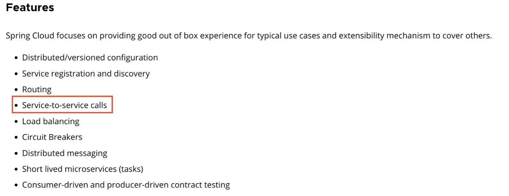
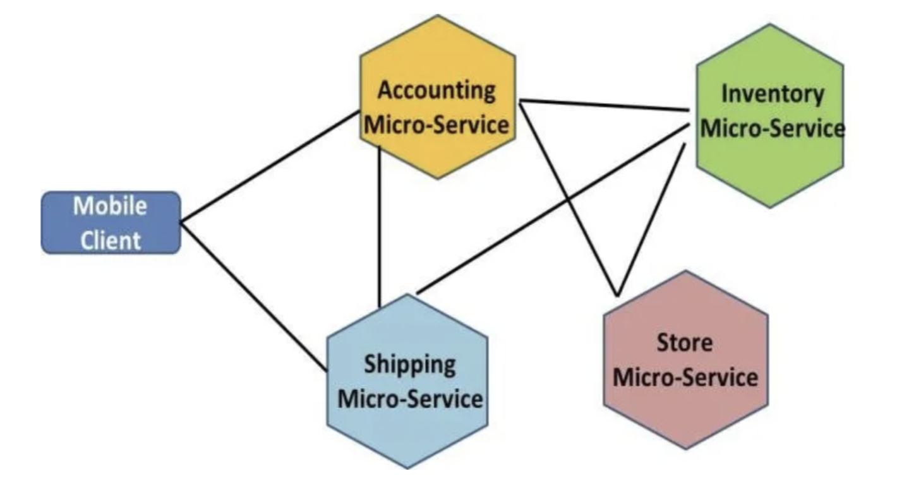

# service-to-service calls

## 세 줄 요약

- service to service call은 분산 환경에서 서로 다른 서비스 들의 데이터 교환, 상호 작용을 의미한다.
- http, mq, rpc 등의 개념으로 구성돼 있다. (다만, mq, rpc는 다른 챕터에서 다루기 때문에 해당 글에서는 http를 다룬다!)
- spring cloud에서는 openfeign이 기본 스택이다.

---

## 설명

### 왜 Service to Service Call을 핵심 기능으로 볼까?



---


- 분산 애플리케이션 환경은 여러 애플리케이션들의 상호 작용으로 하나의 결과물을 만들어 낸다.
- 이러한 애플리케이션 간 상호 작용을 고도화할 수록 통신 방법, 도구 관리 등의 요소에 대한 중요도도 또한 높아진다.
- 쉽게 이야기하면 복잡하고 다루기 어려운데, 분산 환경에서는 꼭 필요한 요소이니까!

---

### openfeign

#### 설명

- Open Feign은 Netflix에 의해 처음 만들어진 Declarative HTTP Client 도구이며, 외부 API 호출을 쉽게할 수 있도록 도와준다.
- github discription과 같이`Feign makes writing java http clients easier` 를 추구한다.

##### 샘플
```java

@FeignClient(url = "${uri}")
public interface OrderFeignClient {
    @GetMapping
    Response order(@RequestParam String name, @RequestParam Currency currencies);
}
```

#### 장점

- 애노테이션을 사용하여 간단하게 사용할 수 있다.
- Spring Cloud와의 뛰어난 통합, Ribbon을 사용한 로드 밸런싱, Hystrix를 사용한 서킷 브레이커 등 다양한 기능 제공한다.
- 인터페이스 기반의 정의로 가독성이 좋다.

#### 단점

- HTTP 요청에 대한 제어가 제한적.
- 추가 추상화 계층으로 인해 다른 클라이언트보다 성능 오버헤드가 있을 수 있음.