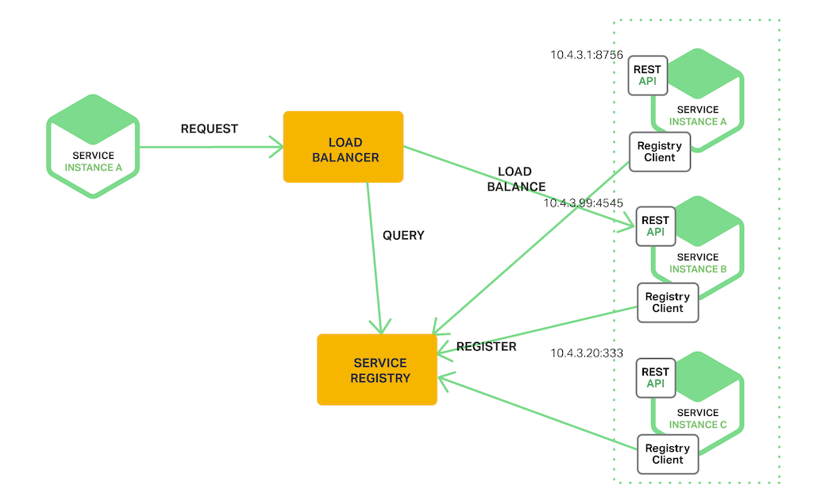

# service registration and discovery
---

## 세 줄 요약

- 최신 마이크로서비스 기반 애플리케이션은 일반적으로 서비스 인스턴스 수와 해당 위치가 동적으로 변경되는 가상화되거나 컨테이너화된 환경에서 실행된다.
- 이러한 환경에서는 서비스 클라이언트가 동적으로 변경되는 임시 서비스 인스턴스 집합에 요청할 수 있도록 하는 메커니즘을 구현해야 한다.
- 이를 해결하기 위한 개념이 `service registration and discovery`이고, [spring cloud](https://spring.io/projects/spring-cloud)
  에서는 [consul](https://cloud.spring.io/spring-cloud-consul/reference/html/#spring-cloud-consul-discovery), [eureka](https://cloud.spring.io/spring-cloud-netflix/reference/html/#service-discovery-eureka-clients), [k8s](https://docs.spring.io/spring-cloud-kubernetes/reference/spring-cloud-kubernetes-discoveryserver.html)
  등의 구현체를 제공한다.

---

## 설명

### 간략 소개

애플리케이션들은 서로 데이터를 주고 받으며 어떠한 가치를 생성하는데, 주로 ip & port를 활용해 통신한다.
마이크로서비스 기반 애플리케이션은 서비스 인스턴스의 수와 위치가 동적으로 변경돼 클라이언트 입장에서는 고정된 ip & port 값을 참조해 사용하기 어렵다.
그래서 클라이언트가 동적으로 변경되는 서비스 인스턴스 집합에 요청할 수 있는 매커니즘이 필요하고, 이러한 가치는 service discovery라는 개념으로 제공되고 있다.

---

### 구현 방법

#### Client Side Service Discovery

클라이언트가 서비스 디스커버리에서 서비스 인스턴스를 찾아 요청을 보내는 방식이다.

##### 장점

- 로드밸런서가 존재하지 않기 때문에 구성이 비교적 간단하다.
- 클라이언트가 서비스 인스턴스에 대한 정보를 직접 참조하기 때문에 로드밸런싱 방식에 대한 선택권이 클라이언트에게 있다.

##### 단점

- 클라이언트와 서비스 디스커버리가 직접적으로 연결돼 있어 다소 의존적이라고 표현할 수 있다.
- 로드밸런싱에 대한 책임이 클라이언트에게 있다.
    - 비즈니스 로직 외의 가치에 대해서 고민해야 한다.

#### Server Side Service Discovery

서비스 앞에 로드밸런서를 구성하고, 클라이언트는 로드밸런서에 요청을 보내면 로드밸런서가 서비스 디스커버리를 참조해 서비스 인스턴스를 찾는 방식이다.

##### 장점

- 클라이언트와 서비스 디스커버리가 직접적으로 연결돼 있지 않아 의존적이지 않다고 표현할 수 있다.
- 로드밸런싱에 대한 책임이 로드밸런서에게 있다.
    - 비즈니스 로직 외의 가치에 대해서 고민하지 않아도 된다.

##### 단점

- 로드밸런서를 구축해야 한다.
    - spring cloud stack에서는 `lb` 라는 protocol을 제공하기 때문에 구축 난이도가 낮다!

---

## 활용 예시

- 서비스에 Read Traffic이 폭발적으로 늘어날 때, 즉 Query를 담당하는 서비스 인스턴스의 수가 부족할 때 Query 인스턴스에 대해 Scale Out을 수행하고 이를 쉽게 참조할 수 있다.
- k8s service domain과 같이 인프라/플랫폼에 종속적인 dns 도구를 사용하지 않고 어플리케이션 생태계에서 해결할 수 있다.

---

## references

- [Pattern: Server-side service discovery](https://microservices.io/patterns/server-side-discovery.html)
- [Service Registration and Discovery](https://spring.io/guides/gs/service-registration-and-discovery)