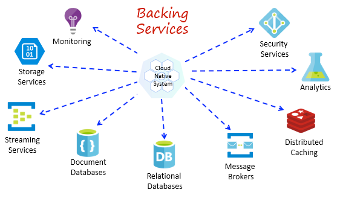

# what is cloud native?

---

## 클라우드 네이티브란?

- **클라우드 컴퓨팅** 환경에서 현대적 애플리케이션을 구축, 배포 및 관리할 때의 소프트웨어 접근 방식
- **신속하게 업데이트**할 수 있는 확장성, **유연성 및 복원력이 뛰어난** 애플리케이션 구축을 지향점으로 설정함

### 클라우드 컴퓨팅

- 외부 데이터 센터에서 호스팅되며, 사용자가 종량제 방식으로 사용할 수 있는 소프트웨어 인프라
- 주로 **분산형** 클라우드의 형태로 구축함

---

## 클라우드 네이티브 애플리케이션이란?

- 마이크로서비스라는 **여러 개의 상호 의존적인 소규모 서비스로 구성된 소프트웨어**
- 이러한 마이크로서비스는 **최소한의 컴퓨팅 리소스만 사용**하여 **독립적으로 작동하고 실행**되도록 하여, 애플리케이션의 민첩성이 향상됨

### 특징

- 지속적 통합 (CI)
    - 개발자가 오류 없이 자주 변경 사항을 공유 코드 베이스에 통합
    - 문제를 더 빠르게 식별하고 해결
    - 변경 사항이 있을 때마다 코드 품질을 자동으로 평가하므로 개발 팀이 보다 높은 신뢰도 보장
- 지속적 전달/배포 (CD)
    - CD를 사용하여 언제든 마이크로서비스를 클라우드에 배포
    - 소프트웨어 자동화 도구를 사용하여 새 기능을 도입하고 애플리케이션의 버그를 수정하는 등의 변경에 따른 위험 감소
- DevOps
- 서버리스
    - 클라우드 제공업체가 기반 서버 인프라를 전적으로 관리
    - 클라우드 인프라가 애플리케이션 요구 사항에 맞게 자동으로 확장 및 구성
    - 앱 실행이 중지되면 자동으로 컴퓨팅 리소스를 제거

### 이점

- 더 빠른 개발
    - 클라우드 네이티브 접근 방식을 사용하여 개발 시간을 단축하고 더 나은 품질의 애플리케이션을 실현
    - 특정 하드웨어 인프라에 의존하는 대신 DevOps 방식으로, 즉시 배포할 수 있는 컨테이너화된 애플리케이션을 구축
    - 다만, 다양한 프레임워크에서는 특정 인프라에 의존하지 않고 다양한 인프라에서도 동작할 수 있도록 지원함
- 플랫폼 독립성
    - 클라우드에서 애플리케이션을 빌드하고 배포함으로써 운영 환경의 일관성과 신뢰성을 보장
    - 인프라를 설정하는 작업이 아니라 앱에서 가치를 제공하는 데 집중
- 비용 효율적인 운영
    - 애플리케이션에서 실제로 사용하는 리소스에 대해서만 비용을 지불하면 됨